# DevToolkit | Professional Developer Utilities & SDK Tools

DevToolkit is a comprehensive, offline-capable suite of developer utilities designed for modern software teams. Built with **Next.js 16**, **React 19**, **Tailwind CSS v4**, and **Bun**, it provides high-performance tools for generating, converting, and formatting data securely and efficiently.

## 🚀 Key Features

### 🛠 Generators

- **ID Generator**: UUID v4, CUID, NanoID, ULID, and more.
- **Password Generator**: Custom rules, character sets, and complexity analysis.
- **QR Code Generator**: High-quality SVG/PNG output for URLs, WiFi, and vCards.
- **Hash/HMAC Generator**: MD5, SHA-1, SHA-256, SHA-512 with custom secrets.
- **Encryption**: AES-GCM and AES-CBC encryption/decryption.
- **Password Hasher**: Secure hashing with bcrypt, Argon2, scrypt, and PBKDF2.
- **Mock Data**: Random user profiles, addresses, and structured JSON.
- **Thai CID Generator**: Valid random Thai Citizen ID numbers for testing.
- **CSS Gradient**: Visual linear, radial, and conic gradient builder.

### 🔄 Converters

- **Timestamp**: Human-readable ↔ Unix timestamp conversion.
- **Timezone**: Real-time conversion across global timezones.
- **Base64**: Live encoding/decoding for strings and images.
- **Image Converter**: Robust conversion between PNG, JPEG, WebP, and BMP.
- **Color Converter**: HEX, RGB, HSL, and other format mapping.
- **Number Base**: Binary, Octal, Decimal, and Hexadecimal conversion.
- **Data Converter**: High-speed CSV ↔ JSON transformations.
- **CSS Units**: Px, Rem, Em, VW, and VH calculations.

### 📦 JSON & SDK Tools

- **JSON Formatter**: Prettify, minify, and validate with syntax highlighting.
- **JSON to TypeScript**: Instant interface generation from raw JSON.
- **JSON to Schema**: Automatic JSON Schema (Draft-07) generation.
- **JSON Compare**: Side-by-side object diffing.
- **JWT Decoder/Builder**: Inspect or sign JSON Web Tokens with custom claims.
- **URL Encoder**: Secure URL component and query string handling.

### 📝 Strings & Regex

- **String Utils**: Case conversion, character counting, and text manipulation.
- **Regex Tester**: Real-time expression testing with highlighted matches.
- **Text Diff**: Clean character-by-character and line-by-line comparisons.
- **Cron Reader**: Human-readable parsing of cron schedule expressions.

---

## 🛡️ Serverless E2EE WebRTC P2P Direct Share (สถาปัตยกรรมและขั้นตอนการทำงาน)

ฟีเจอร์ **Secure Share** เป็นระบบส่งไฟล์และโฟลเดอร์แบบ Peer-to-Peer (P2P) โดยตรงระหว่างบราวเซอร์ (Serverless) 100% ไม่ต้องผ่าน Signaling Server หรือ Cloud Storage ใด ๆ ในการรับส่งข้อมูล ทำให้มีความปลอดภัยสูงสุดระดับ End-to-End Encryption (E2EE) ผ่านโพรโทคอล WebRTC

### 📊 แผนภาพจำลองการทำงานอย่างละเอียด (Detailed P2P Flow Diagram)

```mermaid
sequenceDiagram
    autonumber
    actor P1 as Peer 1 (Sender)
    actor P2 as Peer 2 (Recipient)

    Note over P1: 1. ขั้นตอนเตรียมไฟล์และการสร้าง Offer
    P1->>P1: เลือกไฟล์/โฟลเดอร์ที่ต้องการส่ง
    P1->>P1: บีบอัดไฟล์เป็นไฟล์ ZIP ก้อนเดียวผ่าน JSZip บนบราวเซอร์
    P1->>P1: คำนวณรหัสตรวจสอบ SHA-256 Hash ของไฟล์ ZIP ก้อนนั้น
    P1->>P1: สร้าง RTCPeerConnection & RTCDataChannel
    P1->>P1: สร้าง SDP Offer (ข้อมูล Local Description)
    P1->>P1: รวบรวมตำแหน่งเครือข่าย ICE Candidates (stun:stun.l.google.com)
    P1->>P1: บีบอัด SDP เป็นรหัส Base64 (Initiator Code)
    P1->>P1: แปลงรหัสเป็น QR Code / ลิงก์จับคู่ด่วน

    Note over P1, P2: 2. ขั้นตอนการจับคู่แบบ Serverless (Handshake)
    P1-->>P2: ส่ง QR Code หรือรหัส Base64 Offer ผ่านช่องทางภายนอก

    Note over P2: 3. ขั้นตอนตอบรับการเชื่อมต่อ (Answer)
    P2->>P2: สแกน QR Code หรือวางรหัส Offer ในหน้าต่างรับไฟล์
    P2->>P2: ถอดรหัส Base64 คืนค่าเป็น SDP Offer
    P2->>P2: สร้าง RTCPeerConnection
    P2->>P2: กำหนดค่ารีโมตเซสชัน (Set Remote Description - Offer)
    P2->>P2: สร้าง SDP Answer (ข้อมูล Local Description ของตนเอง)
    P2->>P2: รวบรวมตำแหน่งเครือข่าย ICE Candidates
    P2->>P2: บีบอัด SDP Answer เป็นรหัส Base64 (Response Code)

    P2-->>P1: ส่งรหัส Response หรือแสดง QR Code ตอบกลับ (Out-of-Band)

    Note over P1: 4. เริ่มสร้างท่อเชื่อมต่อ P2P โดยตรง
    P1->>P1: วางรหัส Response และถอดรหัสคืนค่าเป็น SDP Answer
    P1->>P1: กำหนดค่ารีโมตเซสชัน (Set Remote Description - Answer)
    P1->>P1: WebRTC ทำการเจาะพอร์ตจับคู่เครือข่ายโดยตรง (P2P Hole Punching)
    P1->>P2: ท่อส่งข้อมูลหลัก DataChannel เชื่อมต่อสำเร็จ (State: Connected)

    Note over P1, P2: 5. การสตรีมไฟล์แบบ Binary พร้อม Congestion Control
    P1->>P2: ส่ง Meta ข้อมูลไฟล์ปลายทาง (ชื่อไฟล์, ขนาดไฟล์ทั้งหมด, รหัส SHA-256 Hash)
    loop ส่งทีละ Chunk ขนาด 64KB
        P1->>P1: หั่นก้อนข้อมูลขนาด 64KB จาก ArrayBuffer ของไฟล์ ZIP
        alt ตรวจพบปริมาณข้อมูลตกค้างในท่อ (dc.bufferedAmount > 1MB)
            Note over P1: ระบบป้องกันหน่วยความจำล้นทำงาน (Backpressure)
            P1->>P1: สั่งหยุดการส่งชั่วคราว รอสัญญาณรีเซ็ต (dc.onbufferedamountlow)
        else ปริมาณข้อมูลในท่อต่ำกว่าเกณฑ์ (dc.bufferedAmount <= 1MB)
            P1->>P2: ส่งก้อนข้อมูล Chunk ไปยังบราวเซอร์ผู้รับโดยตรง
            P2->>P2: นำ Chunk ที่ได้รับเก็บเข้าอาร์เรย์สะสม (incomingChunks)
            P2->>P2: คำนวณความคืบหน้าการโอนย้าย ความเร็วเฉลี่ย และเวลาที่เหลือ (ETA)
        end
    end

    P1->>P2: ส่งสัญญาณเสร็จสิ้นขั้นตอนการสตรีม: { type: 'done' }

    Note over P2: 6. ขั้นตอนการตรวจสอบความถูกต้องและการดึงไฟล์ออก
    P2->>P2: ประกอบเศษ Chunk ทั้งหมดกลับคืนเป็นก้อน ZIP Blob ก้อนเดียว
    P2->>P2: คำนวณ SHA-256 Hash ของ ZIP Blob ที่ได้รับใหม่
    P2->>P2: เปรียบเทียบ Hash ปลายทางกับต้นทาง (Integrity Check)
    alt รหัส Hash ตรงกันสมบูรณ์
        P2-->>P2: แยกไฟล์และโฟลเดอร์ดั้งเดิมด้วยการถอดรหัส Zip
        P2-->>P2: ป้องกัน Path Traversal (กรองตัวอักษร "../" และ "\")
        P2-->>P2: เตรียมไฟล์ให้ดาวน์โหลดลงเครื่องได้ทันที
    else รหัส Hash ไม่ตรงกัน
        P2-->>P2: แสดงข้อความแจ้งเตือนความเสี่ยง (Integrity Mismatch Warning)
    end

    Note over P1, P2: 7. การทำความสะอาดขยะบน RAM (Garbage Collection)
    P1->>P1: สั่งยุติการเชื่อมต่อและทำลายอ็อบเจกต์ท่อส่งสัญญาณ
    P2->>P2: ล้างตัวแปรสะสมเศษไฟล์ใน RAM ทันที (incomingChunksRef.current = [])
    P2->>P2: ยกเลิกการผูกอ็อบเจกต์ Blob URL ทั้งหมดภายในเวลา 1 วินาที
```



---

### 🔍 คำอธิบายกลไกการทำงานระดับลึก (Deep-Dive Mechanism)

#### 1. การจับคู่โดยไม่พึ่งพาเซิร์ฟเวอร์กลาง (Serverless Handshake)

- **กลไก**: โดยปกติ WebRTC จำเป็นต้องใช้ระบบสื่อสารคนกลาง (Signaling Server) ในการแลกเปลี่ยนข้อมูล SDP (Session Description Protocol) แต่เครื่องมือนี้ได้ย้ายงานดังกล่าวมาให้ผู้ใช้ทำหน้าที่เป็นคนส่งข้อมูลเหล่านั้นด้วยตัวเองผ่านการคัดลอกรหัสหรือการสแกน QR Code (Out-of-band signaling)
- **การรวบรวมตำแหน่งเครือข่าย**: ระบบจะตั้งค่าเซิร์ฟเวอร์ STUN ของ Google เพื่อช่วยหาไอพีจริงและพอร์ตภายนอกของผู้ใช้ (NAT traversal) จากนั้นรอจนกระทั่งไอพีภายนอกทั้งหมดถูกควบรวมเข้าเป็นก้อน SDP ชุดสมบูรณ์ก่อนที่จะทำการบีบอัดเป็นรหัสผ่าน Base64 ทำให้การจับคู่เสร็จสิ้นอย่างสมบูรณ์แบบโดยไม่ต้องแลกเปลี่ยนข้อมูลหลายรอบ

#### 2. การควบคุมความเร็วและป้องกันหน่วยความจำล้น (Dynamic Backpressure Control)

- **ปัญหาหน่วยความจำ**: หากเราสตรีมข้อมูลที่มีขนาดใหญ่ลงไปใน DataChannel ของ WebRTC อย่างต่อเนื่อง บราวเซอร์ผู้ส่งจะพยายามแคชข้อมูลเหล่านั้นไว้ในหน่วยความจำ RAM ของเครื่องส่งผลให้ RAM สูงขึ้นอย่างรวดเร็ว (RAM bloat) และอาจนำไปสู่บราวเซอร์ล่ม (Crash)
- **วิธีการแก้ปัญหา**: ระบบออกแบบกลไกป้องกันหน่วยความจำล้นด้วยการมอนิเตอร์ `dc.bufferedAmount` หากข้อมูลที่รอการนำส่งสะสมเกินระดับปลอดภัยที่ **1 MB (1,048,576 bytes)** การสตรีมข้อมูลจะหยุดทำงานลงทันที และจะเปิดใช้งาน Event Hook `dc.onbufferedamountlow` เพื่อรอจนบราวเซอร์ส่งข้อมูลออกไปและเคลียร์พื้นที่ในท่อส่งให้พร้อม ระบบจึงจะดึงก้อนข้อมูล 64KB ถัดไปขึ้นมาส่งต่อ

#### 3. สถาปัตยกรรมรักษาความปลอดภัยและการป้องกัน Path Traversal

- **E2EE แท้จริง**: ข้อมูลการแชร์ของท่านจะวิ่งจากบราวเซอร์ของผู้ส่งไปยังผู้รับโดยตรง (Point-to-Point) ผ่านเทคโนโลยี WebRTC DTLS-SRTP ที่มีการเข้ารหัสข้อมูลตั้งแต่ต้นทางถึงปลายทางโดยไม่มีเซิร์ฟเวอร์ตัวกลางใด ๆ สามารถอ่านหรือดักจับไฟล์เหล่านั้นได้
- **SHA-256 Verification**: ก่อนทำการส่งไฟล์ ต้นทางจะนำข้อมูล Binary ก้อนที่จะแชร์มาผ่านกระบวนการแฮช SHA-256 (`crypto.subtle.digest`) เมื่อฝั่งผู้รับโอนถ่ายข้อมูลเสร็จสิ้น จะคำนวณรหัส SHA-256 ใหม่อีกรอบและตรวจเช็กกับต้นทางแบบเทียบความถูกต้องบิตต่อบิต เพื่อป้องกันเหตุการณ์ข้อมูลสูญหาย หรือเสียหายระหว่างการโอนย้าย
- **Path Traversal Shield**: ในขั้นตอนการสกัดไฟล์และโฟลเดอร์ดั้งเดิมออกจากโมดูล ZIP ฝั่งผู้รับจะทำการกรองเส้นทางของไฟล์ (Path Sanitization) โดยการลบจุดย้อนกลับ `../` และแปลงเครื่องหมายแฮนเดิลแบ็กสแลช `\` ทั้งหมดทิ้งเพื่อป้องกันไม่ให้ผู้ส่งส่งไฟล์ที่ประสงค์ร้ายเข้ามาทับไฟล์ระบบระบบปฏิบัติการของผู้รับ

#### 4. ระบบรองรับกรณีผิดพลาด (Fail-Safe & Graceful Teardown)

- **การตรวจสอบขนาดข้อมูล**: ทุกครั้งที่เกิดเหตุการณ์ท่อเชื่อมต่อหลุดกะทันหัน (`dc.onclose`) ระบบจะนำขนาดของข้อมูลที่สะสมอยู่ใน `receivedBytesRef` มาเปรียบเทียบกับขนาดจริงในเมทาดาตา หากข้อมูลมีขนาดต่ำกว่าที่ตกลงไว้ ระบบจะแจ้งเตือนผู้ใช้งานถึงความผิดพลาดและยกเลิกกระบวนการประกอบไฟล์ที่ชำรุดทันที
- **การล้างหน่วยความจำระดับสูง (RAM Recovery)**: หลังจากกระบวนการแปลงรหัสและส่งมอบไฟล์ลงเครื่องผู้รับสำเร็จ ระบบจะดำเนินการล้างอาร์เรย์สะสมก้อนข้อมูล (`incomingChunksRef.current = []`) เพื่อเรียกคืนพื้นที่บนหน่วยความจำแรมทันที และมีการหน่วงเวลา 1 วินาทีก่อนจะเรียกใช้คำสั่ง `URL.revokeObjectURL()` เพื่อเคลียร์ไฟล์แคชออกจากหน่วยความจำของบราวเซอร์อย่างสมบูรณ์แบบ ป้องกันปัญหา Memory Leak เมื่อผู้ใช้แชร์ไฟล์ขนาดใหญ่ระดับกิกะไบต์เป็นจำนวนหลายรอบ

---

## 💻 Tech Stack

- **Framework**: [Next.js 16 (App Router)](https://nextjs.org/)
- **Core**: [React 19](https://react.dev/)
- **Styling**: [Tailwind CSS v4](https://tailwindcss.com/)
- **Runtime**: [Bun](https://bun.sh/)
- **Icons**: [Lucide React](https://lucide.dev/)
- **Animations**: [Framer Motion](https://www.framer.com/motion/)
- **UI Components**: [Shadcn UI](https://ui.shadcn.com/) (Customized)
- **Image Processing**: [Sharp](https://sharp.pixelplumbing.com/)

---

## 📦 Getting Started

### Prerequisites

- [Bun](https://bun.sh/) (v1.1 or later recommended)
- [Node.js](https://nodejs.org/) (for Sharp compatibility if required)

### Installation

```bash
bun install
```

### Development

```bash
bun dev
```

Open [http://localhost:3000](http://localhost:3000) with your browser to start using the tools.

### Build

```bash
bun run build
bun start
```

---

## 📱 PWA Support

DevToolkit is a **Progressive Web App**. It is fully installable on desktop and mobile devices and features:

- **Offline Shell**: Core utilities work without an internet connection.
- **Fast Refresh**: Assets are cached for immediate subsequent loads.
- **Standalone UI**: Removes browser chrome for an app-like experience.

## 🔍 SEO & Visibility

The project is built with SEO in mind, featuring:

- **Dynamic Metadata**: Unique search titles and descriptions for every tool.
- **Thai & English Support**: Bilingual metadata for global reach.
- **High-Impact Assets**: AI-generated premium Open Graph images and icons.

---

## 📄 License

This project is private and intended for internal developer use. All code comments have been removed per project styling guidelines.
