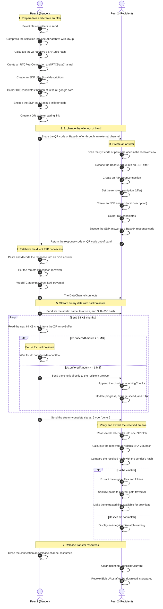

# DevToolkit | Professional Developer Utilities & SDK Tools

DevToolkit is a comprehensive, offline-capable suite of developer utilities designed for modern software teams. Built with **Next.js 16**, **React 19**, **Tailwind CSS v4**, and **Bun**, it provides high-performance tools for generating, converting, and formatting data securely and efficiently.

## 🚀 Key Features

### 🛠 Generators

- **ID Generator**: UUID v4, CUID, NanoID, ULID, and more.
- **Password Generator**: Custom rules, character sets, and complexity analysis.
- **QR Code Generator**: High-quality SVG/PNG output for URLs, WiFi, and vCards.
- **Hash/HMAC Generator**: MD5, SHA-1, SHA-256, SHA-512 with custom secrets.
- **Encryption**: AES-GCM and AES-CBC encryption/decryption.
- **Password Hasher**: Secure hashing with bcrypt, Argon2, scrypt, and PBKDF2.
- **Mock Data**: Random user profiles, addresses, and structured JSON.
- **Thai CID Generator**: Valid random Thai Citizen ID numbers for testing.
- **CSS Gradient**: Visual linear, radial, and conic gradient builder.

### 🔄 Converters

- **Timestamp**: Human-readable ↔ Unix timestamp conversion.
- **Timezone**: Real-time conversion across global timezones.
- **Base64**: Live encoding/decoding for strings and images.
- **Image Converter**: Robust conversion between PNG, JPEG, WebP, and BMP.
- **Image Resizer**: Batch resize PNG, JPEG, and WebP images by exact dimensions, percentage, or presets.
- **Color Converter**: HEX, RGB, HSL, and other format mapping.
- **Number Base**: Binary, Octal, Decimal, and Hexadecimal conversion.
- **Data Converter**: High-speed CSV ↔ JSON transformations.
- **CSS Units**: Px, Rem, Em, VW, and VH calculations.

### 📦 JSON & SDK Tools

- **JSON Formatter**: Prettify, minify, and validate with syntax highlighting.
- **JSON to TypeScript**: Instant interface generation from raw JSON.
- **JSON to Schema**: Automatic JSON Schema (Draft-07) generation.
- **JSON Compare**: Side-by-side object diffing.
- **JWT Decoder/Builder**: Inspect or sign JSON Web Tokens with custom claims.
- **URL Encoder**: Secure URL component and query string handling.

### 📝 Strings & Regex

- **String Utils**: Case conversion, character counting, and text manipulation.
- **Regex Tester**: Real-time expression testing with highlighted matches.
- **Text Diff**: Clean character-by-character and line-by-line comparisons.
- **Cron Reader**: Human-readable parsing of cron schedule expressions.

---

## 🛡️ Secure Share: Serverless WebRTC P2P Transfer

**Secure Share** transfers files and folders directly between browsers over a WebRTC data channel. It does not use an application signaling server or cloud storage for the transfer. Peers exchange the offer and answer out of band, such as through a QR code or copied pairing code. A public STUN service is used for NAT discovery; direct connectivity is therefore subject to the peers' networks and NAT/firewall configuration.

### 📊 Detailed P2P Flow Diagram


```mermaid
sequenceDiagram
    autonumber
    actor P1 as Peer 1 (Sender)
    actor P2 as Peer 2 (Recipient)

    Note over P1: 1. Prepare files and create an offer
    P1->>P1: Select files or folders to send
    P1->>P1: Compress the selection into one ZIP archive with JSZip
    P1->>P1: Calculate the ZIP archive's SHA-256 hash
    P1->>P1: Create an RTCPeerConnection and RTCDataChannel
    P1->>P1: Create an SDP offer (local description)
    P1->>P1: Gather ICE candidates through stun:stun.l.google.com
    P1->>P1: Encode the SDP as a Base64 initiator code
    P1->>P1: Create a QR code or pairing link

    Note over P1, P2: 2. Exchange the offer out of band
    P1-->>P2: Share the QR code or Base64 offer through an external channel

    Note over P2: 3. Create an answer
    P2->>P2: Scan the QR code or paste the offer in the receiver view
    P2->>P2: Decode the Base64 value into an SDP offer
    P2->>P2: Create an RTCPeerConnection
    P2->>P2: Set the remote description (offer)
    P2->>P2: Create an SDP answer (local description)
    P2->>P2: Gather ICE candidates
    P2->>P2: Encode the SDP answer as a Base64 response code

    P2-->>P1: Return the response code or QR code out of band

    Note over P1: 4. Establish the direct P2P connection
    P1->>P1: Paste and decode the response into an SDP answer
    P1->>P1: Set the remote description (answer)
    P1->>P1: WebRTC attempts direct NAT traversal
    P1->>P2: The DataChannel connects

    Note over P1, P2: 5. Stream binary data with backpressure
    P1->>P2: Send file metadata: name, total size, and SHA-256 hash
    loop Send 64 KB chunks
        P1->>P1: Read the next 64 KB chunk from the ZIP ArrayBuffer
        alt dc.bufferedAmount > 1 MB
            Note over P1: Pause for backpressure
            P1->>P1: Wait for dc.onbufferedamountlow
        else dc.bufferedAmount <= 1 MB
            P1->>P2: Send the chunk directly to the recipient browser
            P2->>P2: Append the chunk to incomingChunks
            P2->>P2: Update progress, average speed, and ETA
        end
    end

    P1->>P2: Send the stream-complete signal: { type: 'done' }

    Note over P2: 6. Verify and extract the received archive
    P2->>P2: Reassemble all chunks into one ZIP Blob
    P2->>P2: Calculate the received ZIP Blob's SHA-256 hash
    P2->>P2: Compare the received hash with the sender's hash
    alt Hashes match
        P2-->>P2: Extract the original files and folders
        P2-->>P2: Sanitize paths to prevent path traversal
        P2-->>P2: Make the extracted files available for download
    else Hashes do not match
        P2-->>P2: Display an integrity-mismatch warning
    end

    Note over P1, P2: 7. Release transfer resources
    P1->>P1: Close the connection and release channel resources
    P2->>P2: Clear incomingChunksRef.current
    P2->>P2: Revoke Blob URLs after the download is prepared
```

---

### 🔍 Deep Dive

#### 1. Serverless Handshake

- **Out-of-band signaling**: WebRTC normally needs signaling to exchange SDP (Session Description Protocol) messages. Secure Share leaves that exchange to the participants, who copy a code or scan a QR code instead of using an application-managed signaling server.
- **Network discovery**: The app gathers ICE candidates through Google's public STUN service, then includes them in the complete SDP payload before encoding it as Base64. This reduces the pairing flow to one offer and one answer exchange.
- **QR scanning**: The `qr-scanner` (Nimiq) library decodes QR codes in a Web Worker to avoid blocking the main thread. **Upload QR Image** also accepts a QR-code image or screenshot when a webcam is unavailable.

#### 2. Dynamic Backpressure Control

- **Why it matters**: Writing a large transfer continuously to a WebRTC DataChannel can cause the sender's browser to buffer excessive data in memory.
- **How it works**: The sender monitors `dc.bufferedAmount`. When queued data exceeds **1 MB (1,048,576 bytes)**, it pauses and waits for `dc.onbufferedamountlow` before sending the next 64 KB chunk.

#### 3. Integrity and Path Safety

- **Transport encryption**: WebRTC encrypts DataChannel traffic in transit between the peers. The application does not route file contents through its own server or cloud storage.
- **SHA-256 verification**: The sender hashes the ZIP archive with `crypto.subtle.digest`. After receiving the complete archive, the recipient calculates the hash again and compares it with the sender's value before extraction.
- **Path sanitization**: The receiver sanitizes paths from the ZIP archive before making files available for download, preventing path-traversal sequences from being used as extraction paths.

#### 4. Failure Handling and Cleanup

- **Incomplete transfers**: When the channel closes, the receiver compares the received byte count with the expected metadata size. Incomplete transfers are reported and are not assembled as a completed download.
- **Memory recovery**: Once the transfer completes or fails, the app clears accumulated chunks and revokes Blob URLs after they are no longer needed.

---

## 💻 Tech Stack

- **Framework**: [Next.js 16 (App Router)](https://nextjs.org/)
- **Core**: [React 19](https://react.dev/)
- **Styling**: [Tailwind CSS v4](https://tailwindcss.com/)
- **Runtime**: [Bun](https://bun.sh/)
- **Icons**: [Lucide React](https://lucide.dev/)
- **Animations**: [Framer Motion](https://www.framer.com/motion/)
- **UI Components**: [Shadcn UI](https://ui.shadcn.com/) (Customized)
- **Image Processing**: Browser Canvas API

---

## 📦 Getting Started

### Prerequisites

- [Bun](https://bun.sh/) (v1.1 or later recommended)
- [Node.js](https://nodejs.org/) (for Sharp compatibility if required)

### Installation

```bash
bun install
```

### Development

```bash
bun dev
```

Open [http://localhost:3000](http://localhost:3000) with your browser to start using the tools.

### Build

```bash
bun run build
bun start
```

---

## 📱 PWA Support

DevToolkit is a **Progressive Web App**. It is fully installable on desktop and mobile devices and features:

- **Offline Shell**: Core utilities work without an internet connection.
- **Fast Refresh**: Assets are cached for immediate subsequent loads.
- **Standalone UI**: Removes browser chrome for an app-like experience.

## 🔍 SEO & Visibility

The project is built with SEO in mind, featuring:

- **Dynamic Metadata**: Unique search titles and descriptions for every tool.
- **Thai & English Support**: Bilingual metadata for global reach.
- **High-Impact Assets**: AI-generated premium Open Graph images and icons.

---

## 📄 License

This project is private and intended for internal developer use. All code comments have been removed per project styling guidelines.
